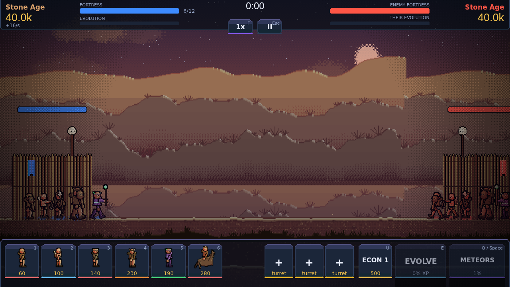

# GOW — Gears of War Through the Ages

A side-view autobattler that spans five ages of warfare. Feed gold into a build
queue, evolve your civilisation from bone clubs to orbital ion cannons, and
level the enemy fortress before they level yours.

Built with **Phaser 3**, **TypeScript** and **esbuild**. It is pixel art, and
every pixel of it is generated procedurally at runtime — along with every
sound. The game ships with no art or audio files at all.



## Play

```bash
npm install
npm start          # dev server on http://localhost:8080
```

```bash
npm run build      # optimised bundle in dist/ — static files, host anywhere
npm run check      # typecheck + production build
```

The `dist/` folder is fully self-contained and works from any static host or
from `file://`. A service worker caches it for offline play, and the PWA
manifest lets it install to a phone home screen.

### Desktop app

```bash
npm run app        # run the desktop build locally
npm run dist       # installers for the current platform, into release/
npm run dist:linux # AppImage + .deb + tar.gz
npm run dist:win   # NSIS installer + portable .exe
npm run dist:mac   # .dmg + .zip
```

The desktop build is Electron loading the bundle over `file://`. It needs no
network connection and has none available: `electron/main.cjs` installs a
request filter that blocks every `http`, `https` and `ws` request at the session
level, and disables Chromium's background networking. The only exception is the
WebRTC peer connection multiplayer opens directly to the other player, which
does not go through the request filter. Nothing phones home, and there is no
account, telemetry or licence check to fail years from now.

## How it plays

You and an AI commander face each other across a single lane. Gold arrives
passively and from kills; experience arrives from kills alone.

- **Queue units** — each has a cost, a build time and a population weight.
  Units march out automatically, engage what they meet, and keep going.
- **Evolve** — once you have enough experience and gold, advance to the next
  age. Your roster is replaced, your fortress is rebuilt and repaired, your
  income and population cap rise, and you unlock a stronger special ability.
- **Build defences** — three turret slots on your fortress. Turrets take
  splash damage when the wall is hit and can be destroyed, sold or replaced.
- **Special ability** — charges over time and faster while you are winning
  fights. Each age has its own: meteors, arrow storms, rolling artillery
  barrages, bomber runs, and a sweeping orbital beam.
- **Economy upgrades** — five levels of compounding income. Buying early wins
  long games; buying late loses short ones.

Win by destroying the enemy fortress.

### Counters matter

Damage types are checked against armour classes, so composition beats spam:

| Damage    | Strong against         | Weak against       |
|-----------|------------------------|--------------------|
| Blunt     | Heavy armour           | Structures, air    |
| Pierce    | Unarmored, light, air  | Heavy, structures  |
| Slash     | Unarmored              | Heavy              |
| Explosive | Structures, heavy      | Light              |
| Energy    | Air, everything evenly | —                  |

Air units can only be hit by units and turrets flagged anti-air. Fielding a
gunship against an opponent with no answer is a game-ender, and so is being
that opponent.

### Controls

| Input            | Action                          |
|------------------|---------------------------------|
| `1` – `7`        | Queue the matching unit         |
| `E`              | Evolve to the next age          |
| `Q` / `Space`    | Fire the special ability        |
| `U`              | Buy the next economy upgrade    |
| `F`              | Cycle game speed (1x / 2x / 3x) |
| `Backspace`      | Cancel the last queued unit     |
| `Esc` / `P`      | Pause                           |
| Drag             | Pan the camera                  |

Everything is also reachable by mouse or touch from the command bar.

## Modes

- **Campaign** — twelve missions, each with its own briefing, enemy start age
  and economic handicap. Three stars per mission: one for the win, one for
  finishing with your fortress mostly intact, one for beating par time.
- **Endless Siege** — the enemy escalates every 45 seconds and never stops.
  Breaking through their fortress does not end it; it buys you three waves.
  Best wave count is recorded per difficulty.
- **Quick Battle** — a single even skirmish at the difficulty you choose.
- **Multiplayer** — one-on-one against another person, peer to peer, with no
  server anywhere in the loop. See below.

Four difficulties change the AI's reaction speed, aggression, economy and how
reliably it picks the unit that counters yours.

## Multiplayer without a server

Two players connect directly to each other by swapping a pair of text codes —
there is no matchmaking service, no lobby server and no relay. One player picks
**HOST** and copies the invite code; the other picks **JOIN**, pastes it, and
sends back the reply code. Paste that into the host's box and the match starts.

The codes are complete WebRTC session descriptions, so once they are exchanged
the two browsers talk to each other and nothing else. **LAN only** mode goes
further and configures zero ICE servers, so the game makes no outbound contact
of any kind — useful on a local network, at an event, or on an air-gapped
machine. With it switched off, a public STUN server is consulted purely to
discover your own public address; game traffic still never passes through it.

What actually crosses the wire is only the commands each player issues — "queue
a spearman", "evolve", "sell turret 2". Both machines run the same fixed-step
simulation from the same seed, so the two worlds stay identical without any
game state being transmitted. See [docs/DESIGN.md](docs/DESIGN.md#lockstep-multiplayer)
for how that is kept honest.

## Content

- **5 ages** — Stone, Medieval, Renaissance, Modern, Future
- **32 units** across melee, ranged, siege, tank, support and air roles
- **12 turrets** in five tiers, including dedicated anti-air
- **5 special abilities**, one per age
- **12 campaign missions** and **12 achievements**

## Architecture

```
src/
  core/         event bus, save/settings, procedural audio synth, seeded RNG
  data/         ages, units, turrets, abilities, campaign levels (pure data)
  gfx/          canvas painters, unit rigs, props, parallax, particles, VFX
  sim/          units, projectiles, bases, armies, AI, the battlefield
  net/          wire protocol, WebRTC peer, deterministic lockstep driver
  scenes/       boot, preload, menu, battle, HUD, multiplayer lobby, results
  ui/           buttons, bars, tooltips, modals
```

Two design decisions shape everything else:

**All art is code, and all of it is pixel art.** `gfx/pixel.ts` owns an integer
pixel grid with Bresenham lines, midpoint ellipses, scanline polygons, ordered
dithering and hue-shifted colour ramps. Nothing goes through the canvas path
API — `fill()` and `stroke()` antialias, and one row of half-transparent edge
pixels is the difference between pixel art and a small blurry drawing.
`unitArt.ts` turns a `UnitVisual` description (helmet, torso, weapon, chassis,
palette) into a set of body-part textures on that grid; `propArt.ts` does the
fortresses, ammunition and terrain. `textureFactory.ts` runs the generators
once at load, spread across frames so the loading bar keeps moving. Adding a
unit means adding a data entry, not an asset.

Art is authored at half scale and displayed at double, with the renderer
sampling nearest-neighbour, so a foot soldier is 33 real pixels tall. See
[docs/DESIGN.md](docs/DESIGN.md#drawing-pixel-art-procedurally) for what that
budget buys and what it forbids.

**The simulation is hand-rolled.** There is no physics engine. `sim/unit.ts`
integrates knockback, gravity and friction directly, drives a procedural walk
cycle by distance travelled, and ragdolls limbs on death.
`sim/projectile.ts` does swept circle-segment collision so a 2600 px/s railgun
slug cannot tunnel through a target, plus ballistic angle solving for anything
that arcs. This keeps the update loop predictable and cheap enough to run
hundreds of entities at 3x speed.

### Adding a unit

Add an entry to `src/data/units.ts`. The `visual` block drives the generated
art, and the `attack` block drives behaviour:

```ts
{
  id: 'halberdier',
  name: 'Halberdier',
  age: 1,
  role: 'melee',
  cost: 240, hp: 700, damage: 60, damageType: 'pierce',
  attackMs: 1200, range: 76, speed: 42,
  bonusVs: { heavy: 1.6 },
  attack: { kind: 'melee', knockback: 70 },
  visual: { kind: 'humanoid', helmet: 'kettle', torso: 'mail', weapon: 'spear', /* … */ }
}
```

It appears in the roster, the codex and the AI's counter-picking automatically.

## Licence

MIT — see [LICENSE](LICENSE).
